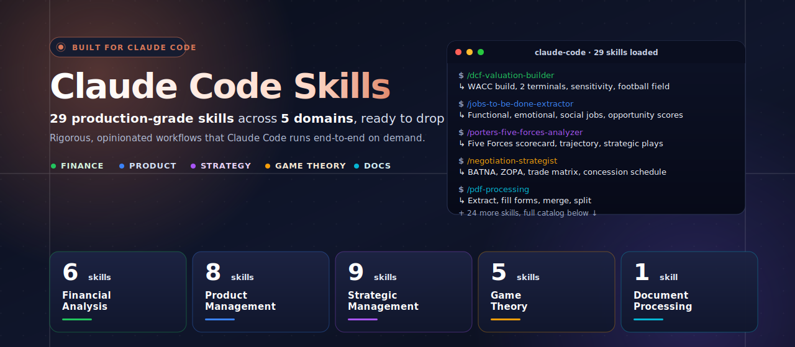
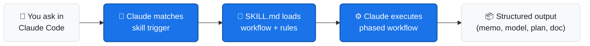

<div align="center">



# 🧰 Claude Code Custom Skills

### A curated, categorized library of production-grade skills for Claude Code — finance, product, strategy, game theory, and document processing.

[](#-skill-categories)
[](#-skill-categories)
[](#-plugin-skills-bundled)
[](LICENSE)
[](https://claude.ai/code)

**Maintained by [Varun Kulkarni](https://github.com/varunk130)**

</div>

---

## Table of Contents

- [What is a skill?](#what-is-a-skill)
- [How it works](#how-it-works)
- [Quickstart](#-quickstart)
- [Skill categories](#-skill-categories)
  - [Financial Analysis](#financial-analysis-6-skills)
  - [Product Management](#product-management-8-skills)
  - [Strategic Management](#strategic-management-9-skills)
  - [Game Theory](#game-theory-5-skills)
  - [Document Processing](#document-processing-1-skill)
- [Plugin skills (bundled)](#-plugin-skills-bundled)
- [Standard skill format](#standard-skill-format)
- [Authoring a new skill](#authoring-a-new-skill)
- [Contributing](#contributing)
- [License](#license)

---

## What is a skill?

A **skill** is a single markdown file (`SKILL.md`) that gives Claude Code domain-specific knowledge, a structured workflow, and clear output expectations. Drop the file into `~/.claude/skills/` and Claude loads it on demand — invoked by slash command or by natural-language match against the description.

Every skill in this repository follows the **same standard format** (see [Standard skill format](#standard-skill-format)) so they're easy to learn, easy to compose, and easy to extend.

## How it works



---

## ⚡ Quickstart

```bash
# 1. Clone this repo
git clone https://github.com/varunk130/claude-code-skills.git
cd claude-code-skills

# 2. Install all skills globally for Claude Code
mkdir -p ~/.claude/skills
cp -r skills/* ~/.claude/skills/

# 3. Restart Claude Code, then invoke any skill
#    Examples:
#      /dcf-valuation-builder
#      /opportunity-solution-tree
#      /strategic-landscape-mapper
#      /negotiation-strategist
```

**Install a single category** (e.g., only the finance skills):

```bash
mkdir -p ~/.claude/skills
cp -r skills/financial-analysis/* ~/.claude/skills/
```

**Project-local install** (skills available only in one project):

```bash
mkdir -p .claude/skills
cp -r /path/to/claude-code-skills/skills/<category>/* .claude/skills/
```

> 💡 New to Claude Code skills? See the [official skills guide](https://docs.anthropic.com/en/docs/claude-code/skills) for installation locations and discovery rules.

---

## 📂 Skill Categories

Skills are organized into five categories. Each category folder has its own README with the full skill index and design principles.

| Category | Skills | What it's for |
|----------|-------:|---------------|
| [💰 Financial Analysis](skills/financial-analysis/) | 6 | Valuation, capital allocation, SaaS economics, cash management, fundamental analysis |
| [📦 Product Management](skills/product-management/) | 8 | Discovery, prioritization, customer research, strategic decisions, communication |
| [🧭 Strategic Management](skills/strategic-management/) | 9 | Industry analysis, positioning, landscape mapping, OKRs, go-to-market |
| [♟️ Game Theory](skills/game-theory/) | 5 | Equilibrium analysis, negotiation, competitive dynamics, mechanism design |
| [📄 Document Processing](skills/document-processing/) | 1 | PDF extraction, form filling, merging |

### Financial Analysis (6 skills)

> Rigorous, defensible financial modeling and analysis. Outputs survive an investment committee or board grilling. — [Category README](skills/financial-analysis/README.md)

| Skill | What it produces |
|-------|------------------|
| [ai-agent-financial-analyst](skills/financial-analysis/ai-agent-financial-analyst/SKILL.md) | Software as a Service (SaaS) financial models: unit economics, ROI calculators, pricing scenarios, revenue projections |
| [burn-rate-runway-planner](skills/financial-analysis/burn-rate-runway-planner/SKILL.md) | Burn decomposition, scenario plans, lever stack, 13-week cash forecast, fundraise trigger calendar |
| [capital-allocation-framework](skills/financial-analysis/capital-allocation-framework/SKILL.md) | Ranked investment portfolio across Net Present Value (NPV), Internal Rate of Return (IRR), Profitability Index (PI), and Equivalent Annual Annuity (EAA) plus strategic option value and risk-adjusted frontier |
| [dcf-valuation-builder](skills/financial-analysis/dcf-valuation-builder/SKILL.md) | Full Discounted Cash Flow (DCF) with WACC build, two terminal-value methods reconciled, sensitivity table, football field |
| [financial-statement-analyzer](skills/financial-analysis/financial-statement-analyzer/SKILL.md) | Form 10-K and Form 10-Q teardown with margin waterfall, quality-of-earnings score, accounting red-flag log |
| [saas-cohort-analyzer](skills/financial-analysis/saas-cohort-analyzer/SKILL.md) | Cohort retention triangles, Net Revenue Retention (NRR) / Gross Revenue Retention (GRR), Lifetime Value (LTV), Customer Acquisition Cost (CAC) payback, movement bridge, segmentation cuts |

### Product Management (8 skills)

> Skills for the modern product manager and product trio: continuous discovery, multi-framework prioritization, customer research synthesis. — [Category README](skills/product-management/README.md)

| Skill | What it produces |
|-------|------------------|
| [ai-decision-engine](skills/product-management/ai-decision-engine/SKILL.md) | Multi-framework strategic recommendations from full project context (Product Requirements Documents (PRDs), research, metrics, competitive intel) |
| [ai-product-strategy](skills/product-management/ai-product-strategy/SKILL.md) | AI opportunity assessments with build / buy / partner analysis and data moat evaluation |
| [ai-stakeholder-translator](skills/product-management/ai-stakeholder-translator/SKILL.md) | 5 audience-tailored communications (engineering, executives, board, customers, sales) from one product update |
| [customer-interview-synthesizer](skills/product-management/customer-interview-synthesizer/SKILL.md) | Coded transcripts, themes, Jobs-to-be-Done (JTBD) signals, forces of progress, opportunity hypotheses |
| [jobs-to-be-done-extractor](skills/product-management/jobs-to-be-done-extractor/SKILL.md) | Functional / emotional / social job statements, job map, outcome scoring, hire / fire analysis |
| [opportunity-solution-tree](skills/product-management/opportunity-solution-tree/SKILL.md) | Outcome → opportunities → solutions → assumption tests, as a living tree |
| [product-discovery-coach](skills/product-management/product-discovery-coach/SKILL.md) | Continuous discovery practice: weekly trio cadence, assumption mapping, discovery / delivery dual track |
| [product-roadmap-prioritizer](skills/product-management/product-roadmap-prioritizer/SKILL.md) | Reach-Impact-Confidence-Effort (RICE) plus Kano plus Must-Should-Could-Won't (MoSCoW) plus Cost of Delay scoring with convergence analysis and quarterly roadmap |

### Strategic Management (9 skills)

> Classical and modern strategy frameworks executed with rigor. — [Category README](skills/strategic-management/README.md)

| Skill | What it produces |
|-------|------------------|
| [blue-ocean-strategy-canvas](skills/strategic-management/blue-ocean-strategy-canvas/SKILL.md) | As-is and to-be value curves, Eliminate-Reduce-Raise-Create (ERRC) grid, non-customer analysis, buyer utility map, sequence test |
| [go-to-market-strategy](skills/strategic-management/go-to-market-strategy/SKILL.md) | Complete go-to-market plan: channels, messaging matrix, launch timeline, success metrics |
| [gtm-engineering](skills/strategic-management/gtm-engineering/SKILL.md) | Go-to-market data infrastructure: lead scoring, routing, lifecycle automation, attribution, reverse-ETL contracts |
| [market-sizing](skills/strategic-management/market-sizing/SKILL.md) | Total / Serviceable / Obtainable Addressable Market (TAM / SAM / SOM) via top-down and bottom-up with assumption tracking |
| [okr-cascade-planner](skills/strategic-management/okr-cascade-planner/SKILL.md) | Company → function → team Objectives and Key Results (OKRs) cascade with alignment map and quarterly rituals |
| [porters-five-forces-analyzer](skills/strategic-management/porters-five-forces-analyzer/SKILL.md) | Five Forces scorecard with dominant force, trajectory, and strategic moves per force |
| [pricing-strategy-analyzer](skills/strategic-management/pricing-strategy-analyzer/SKILL.md) | Pricing analysis with competitive positioning, packaging, and revenue modeling |
| [strategic-landscape-mapper](skills/strategic-management/strategic-landscape-mapper/SKILL.md) | User-need value chain on a maturity axis with environmental forces, operating principles, and strategic plays |
| [swot-tows-analyzer](skills/strategic-management/swot-tows-analyzer/SKILL.md) | Evidence-anchored SWOT plus TOWS matrix producing prioritized strategic options |

### Game Theory (5 skills)

> Apply game theory to real decisions: pricing wars, negotiation, mechanism design, repeated interactions. — [Category README](skills/game-theory/README.md)

| Skill | What it produces |
|-------|------------------|
| [competitive-response-modeler](skills/game-theory/competitive-response-modeler/SKILL.md) | Multi-round action-reaction tree with reaction functions, commitment moves, and signaling analysis |
| [mechanism-design-planner](skills/game-theory/mechanism-design-planner/SKILL.md) | Mechanism design for auctions, matching, and pricing with Incentive Compatibility (IC), Individual Rationality (IR), revenue equivalence, and collusion stress tests |
| [nash-equilibrium-solver](skills/game-theory/nash-equilibrium-solver/SKILL.md) | Pure and mixed Nash equilibria, dominance, subgame perfection, and equilibrium selection |
| [negotiation-strategist](skills/game-theory/negotiation-strategist/SKILL.md) | Best Alternative to a Negotiated Agreement (BATNA), Zone of Possible Agreement (ZOPA), multi-issue trade matrix, anchoring plan, concession schedule, tactical playbook |
| [repeated-game-strategist](skills/game-theory/repeated-game-strategist/SKILL.md) | Critical discount factor, strategy selection (Tit-for-Tat, grim trigger, Pavlov), reputation, and retaliation policy |

### Document Processing (1 skill)

> Document extraction, transformation, merging, and form handling. — [Category README](skills/document-processing/README.md)

| Skill | What it produces |
|-------|------------------|
| [pdf-processing](skills/document-processing/pdf-processing/SKILL.md) | PDF text extraction, form filling, and document merging |

---

## 🔌 Plugin Skills (bundled)

Skills bundled with installed Claude Code plugins. These are maintained by their plugin authors and update whenever you update the plugin.

### Document Skills (anthropic-agent-skills)

| Skill | Description |
|-------|-------------|
| [algorithmic-art](plugin-skills/document-skills/algorithmic-art/SKILL.md) | Generative art with p5.js, seeded randomness, interactive parameters |
| [brand-guidelines](plugin-skills/document-skills/brand-guidelines/SKILL.md) | Apply Anthropic brand colors and typography to artifacts |
| [canvas-design](plugin-skills/document-skills/canvas-design/SKILL.md) | Museum-quality visual art as PDF or PNG |
| [doc-coauthoring](plugin-skills/document-skills/doc-coauthoring/SKILL.md) | Structured 3-stage workflow for co-authoring documentation |
| [docx](plugin-skills/document-skills/docx/SKILL.md) | Create, read, and edit Word documents with tracked changes, comments, and formatting |
| [internal-comms](plugin-skills/document-skills/internal-comms/SKILL.md) | Three-Paragraph (3P) updates, newsletters, FAQs, status reports |
| [mcp-builder](plugin-skills/document-skills/mcp-builder/SKILL.md) | Build Model Context Protocol (MCP) servers to integrate Large Language Models (LLMs) with external services |
| [pdf](plugin-skills/document-skills/pdf/SKILL.md) | Full PDF processing: read, merge, split, rotate, watermark, OCR, encrypt, fill forms |
| [pptx](plugin-skills/document-skills/pptx/SKILL.md) | Create, read, and edit PowerPoint with design guidelines and visual QA |
| [skill-creator](plugin-skills/document-skills/skill-creator/SKILL.md) | Create effective Claude Code skills with progressive disclosure |
| [slack-gif-creator](plugin-skills/document-skills/slack-gif-creator/SKILL.md) | Animated GIFs optimized for Slack with PIL and easing functions |
| [theme-factory](plugin-skills/document-skills/theme-factory/SKILL.md) | 10 pre-set themes plus custom theme generation |
| [web-artifacts-builder](plugin-skills/document-skills/web-artifacts-builder/SKILL.md) | Multi-component HTML artifacts with React, Tailwind CSS, and shadcn/ui |
| [webapp-testing](plugin-skills/document-skills/webapp-testing/SKILL.md) | Test local web applications with Playwright plus server lifecycle management |
| [xlsx](plugin-skills/document-skills/xlsx/SKILL.md) | Spreadsheets with formulas, formatting, and financial modeling conventions |

### Figma Plugin

| Skill | Description |
|-------|-------------|
| [code-connect-components](plugin-skills/figma/code-connect-components/SKILL.md) | Connect Figma design components to code implementations |
| [create-design-system-rules](plugin-skills/figma/create-design-system-rules/SKILL.md) | Generate project-specific design system rules |
| [implement-design](plugin-skills/figma/implement-design/SKILL.md) | Translate Figma designs into production-ready code with 1:1 fidelity |

### Notion Plugin

| Skill | Description |
|-------|-------------|
| [knowledge-capture](plugin-skills/notion/knowledge-capture/SKILL.md) | Conversations to structured Notion documentation |
| [meeting-intelligence](plugin-skills/notion/meeting-intelligence/SKILL.md) | Meeting prep with Notion context and Claude research |
| [research-documentation](plugin-skills/notion/research-documentation/SKILL.md) | Search Notion workspace and synthesize into research documents |
| [spec-to-implementation](plugin-skills/notion/spec-to-implementation/SKILL.md) | Specifications to Notion tasks with implementation plans and tracking |

### Stripe Plugin

| Skill | Description |
|-------|-------------|
| [stripe-best-practices](plugin-skills/stripe/stripe-best-practices/SKILL.md) | Stripe integrations: payments, checkout, subscriptions, Connect |

---

## Standard skill format

Every custom skill in this repository follows the same structure so they are easy to learn, compose, and extend:

```markdown
---
name: <skill-name>
description: "<What the skill produces.> Use when <trigger 1>; <trigger 2>; <trigger 3>."
---

# <Skill Title>

> <One-line tagline / positioning statement.>

## What this skill is
<2–3 sentences describing the skill's role and approach.>

## What it solves
- <Pain 1>
- <Pain 2>
- <Pain 3>

## When to invoke
- <Trigger 1>
- <Trigger 2>
- <Trigger 3>

## Phase 1: ...
## Phase 2: ...
...

## Output
<Bullet list of deliverables produced.>

## Operating rules
**Always:** ...
**Never:** ...
```

Skills also follow two writing conventions: **acronyms are spelled out on first use** with the abbreviation in parentheses, and content uses **professional, neutral vocabulary** that travels well across organizations.

---

## Authoring a new skill

See [docs/SKILL_TEMPLATE.md](docs/SKILL_TEMPLATE.md) for the full template, field-by-field guidance, length targets, and the quality checklist.

Quick checklist:
- Single `SKILL.md` per skill, placed in the right category folder
- Frontmatter with `name` and `description`
- Description includes explicit "Use when…" triggers
- Follows the [Standard skill format](#standard-skill-format) above
- Acronyms spelled out on first use

---

## Contributing

Pull requests welcome. Please keep:
- One skill per pull request for easier review
- Skill placed in the correct category folder
- Format consistent with the standard above
- Description includes the trigger phrases people would actually type

See [CONTRIBUTING.md](CONTRIBUTING.md) for full guidelines and [CODE_OF_CONDUCT.md](CODE_OF_CONDUCT.md).

For security issues, see [SECURITY.md](SECURITY.md).

---

## Related work

Part of a portfolio of AI agent and skill libraries for product, GTM, and decision-making teams.

**Discovery & research**

- [ai-customer-discovery-skills](https://github.com/varunk130/ai-customer-discovery-skills) — Turn raw customer signal into validated product opportunities (5 of 12 shipped)
- [jtbd-extractor](https://github.com/varunk130/ai-customer-discovery-skills/tree/main/skills/jtbd-extractor) — Extract Jobs-to-be-Done statements from research, with opportunity scoring

**Strategy & decisions**

- [AI-Builder-Decision-Analyst](https://github.com/varunk130/AI-Builder-Decision-Analyst) — 11 skills that catch bad bets before you ship across DECIDE / BUILD / COMMUNICATE / LEARN

**Go-to-market**

- [ai-gtm-skill-library](https://github.com/varunk130/ai-gtm-skill-library) — 31 opinionated GTM skills across the full discover → renew lifecycle
- [ai-marketing-claude-skills](https://github.com/varunk130/ai-marketing-claude-skills) — 12 marketing-ops skills with scoring algorithms and statistical frameworks
- [ai-partner-ecosystem-analysis](https://github.com/varunk130/ai-partner-ecosystem-analysis) — Deep research on any ISV, partner, or competitor with a 1-slide PPTX output

**UX & design**

- [ai-ux-skill-library](https://github.com/varunk130/ai-ux-skill-library) — 12 frameworks for designing UX for AI products, agents, and AI-powered experiences

**Multi-agent demos**

- [ai-pm-agents-suite](https://github.com/varunk130/ai-pm-agents-suite) — 6-agent pipeline plus 3 standalone PM agents (decision engine, financial analyst, stakeholder translator) that turn customer feedback into strategy, PRDs, and comms
- [ai-legal-agents-skills-os](https://github.com/varunk130/ai-legal-agents-skills-os) — Agentic operating system for legal work: one master agent, nine specialist skills, MCP + MCP Apps
- [ai-growth-os](https://github.com/varunk130/ai-growth-os) — Compound: a multi-agent growth experiment engine that runs the find → design → ship → learn loop end-to-end, offline
- [ai-customer-acquisition](https://github.com/varunk130/ai-customer-acquisition) — Beacon: five agents allocate a budget across channels, build the creative, and reallocate on week-1 results
- [ai-revops](https://github.com/varunk130/ai-revops) — Atlas: nine agents across GTM, Partnerships, and RevOps take a company into a new market with one Vertical Launch Plan

**Evaluation & operations**

- [AI-Eval-Skills](https://github.com/varunk130/AI-Eval-Skills) — 7 skills to plan, generate, run, interpret, and triage AI agent evaluations
- [ai-workflow-playbooks](https://github.com/varunk130/ai-workflow-playbooks) — 21 playbooks + 10 skills + 4 guardians + 5 runbooks across the 7-stage delivery pipeline

---

## License

[MIT](LICENSE)

---

<div align="center">

<sub>Built by <a href="https://github.com/varunk130">Varun Kulkarni</a> — part of a portfolio of AI agent systems for product, finance, and strategy teams.</sub>

</div>
